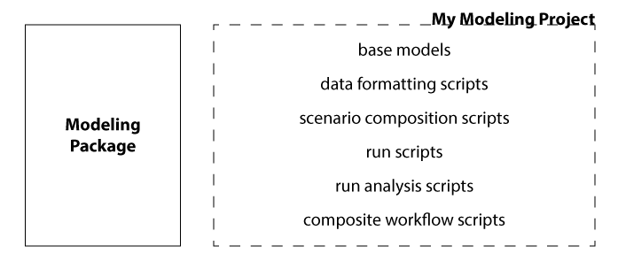

# layerstack overview

Layerstack supports computational analysis of models by making it possible to 
create and share units of work, called **layers**, and then assemble them into
runnable workflows, which are also shareable, called **stacks**. 

## motivation

A lot of scientific and engineering computational work resembles the following schematic. One or more modeling packages are used to run simulations or the like, and this work is supported by a number of scripts that are used to automate other important tasks such as setting up input data, configuring the model package, collecting and visualizing outputs. Modern programming languages make it straightforward to develop such tools; we've come a long way since the days of punch cards. However, there are still some contexts in which this framework is a bit lacking, mostly having to do with collaboration and maintenance.

