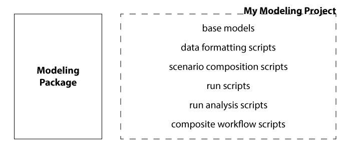
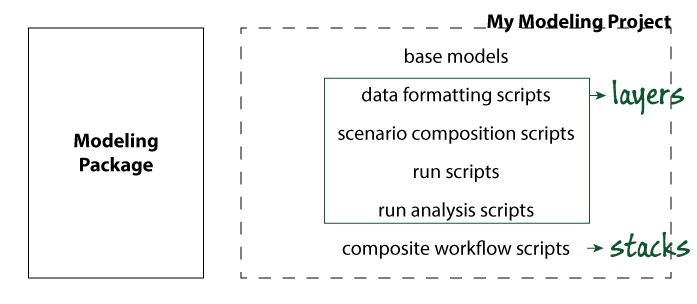
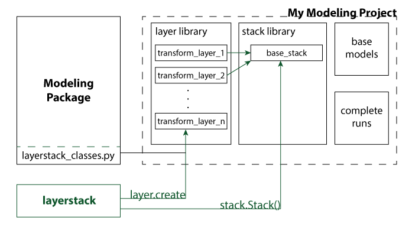

layerstack overview
===================

Layerstack supports computational analysis of models by making it
possible to create and share units of work, called **layers**, and then
assemble them into runnable, shareable workflows, called **stacks**.

motivation
----------

A lot of scientific and engineering computational work resembles the
following schematic. One or more modeling packages are used to run
simulations, optimizations, or other analyses; and this work is
supported by a number of scripts that are used to automate other
important tasks such as setting up input data, configuring the modeling
package, or collecting and visualizing outputs. Modern programming
languages make it straightforward to develop such tools; we’ve come a
long way since the days of punch cards. However, there are still some
contexts in which this framework is a bit lacking, mostly having to do
with collaboration and maintenance.

   typical analysis workflows

The main idea of layerstack is that hidden in the collection of scripts
on the right are a number of units of work that perform specific
functions of potential interest to more than one modeler. Furthermore,
it is sometimes the case that entire workflows composed by performing a
series of such steps are the real unit of work that one would like to
document, share, tweak, replicate, etc.

   layerstack-concept

The core organizing principle of layerstack is to make these units of
work explicit, and to provide features that enable data, algorithm, and
workflow sharing, replication, and extension by a community of modelers.

a layerstack-enabled project
----------------------------

The envisioned use of layerstack is for modelers to write a *Layer*
whenever they have identified some sort of task that they would like to
repeatedly perform in one of their workflows. To create a layer, one
uses the layerstack.layer.Layer.create class method, which creates a new
folder whose name is based on the layer’s name, and which contains a
``layer.py`` Python module. The layer developer then opens the
``layer.py`` module file in a text editor and fills out the template
code that has been placed there. In particular, the developer will need
to specify the positional arguments, keyword arguments, and programming
logic that is invovled in applying the layer. Layers are typically
applied to models, but they can also be model-free, in which case they
might perform various pre- and post-processing tasks.

Once a library of layers has been created, the layers can be assembled
into *Stacks*, which can be saved to disk in json format, and can be
made runnable by setting all of the component layer arguments and
specifying a run directory. A project using layerstack to its fullest in
this way might have an architecture similar to:

   layerstack analysis workflows

in which the project consists of a layer library, a stack library, a set
of base (starting) models, and a database of completed model runs. For
straightforward simulation or optimization models, stacks may be able to
perform entire runs. Starting from a base model, some layers may perform
pre-processing steps, others may transform the model to implement a
scenario or specify variables, one layer may run the simulation or
optimization model itself, and then there may be a series of
post-processing or analysis steps that produce summary datasets or
output visualizations.

To implement this structure, one modeler will need to write a class
derived from ``layerstack.layer.ModelLayerBase``, implement several of
its protected methods (i.e.,
``layerstack.layer.ModelLayerBase._check_model_type``,
``layerstack.layer.ModelLayerBase._load_model``, and
``layerstack.layer.ModelLayerBase._save_model``), and then make the
class definition available to her collaborators (e.g. all users of the
modeling package, or at least her immediate team members). Then, if you
specify this class as the ``layer_base_class`` in
``layerstack.layer.Layer.create``, ``layerstack.stack.Stack`` will know
how to identify, load, and save the models that you want to operate on
with your layers.

.. toctree::
   :maxdepth: 2

   index
   api

Indices and tables
==================

* :ref:`genindex`
* :ref:`modindex`
* :ref:`search`
